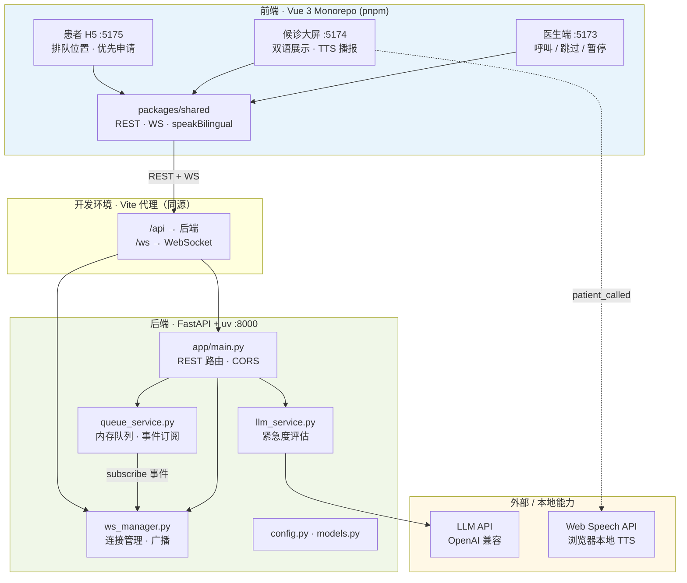
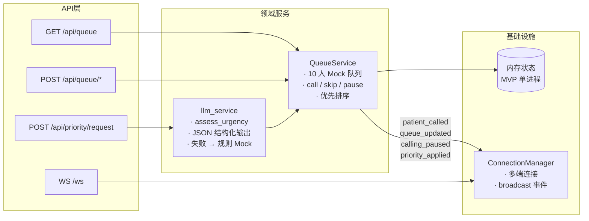
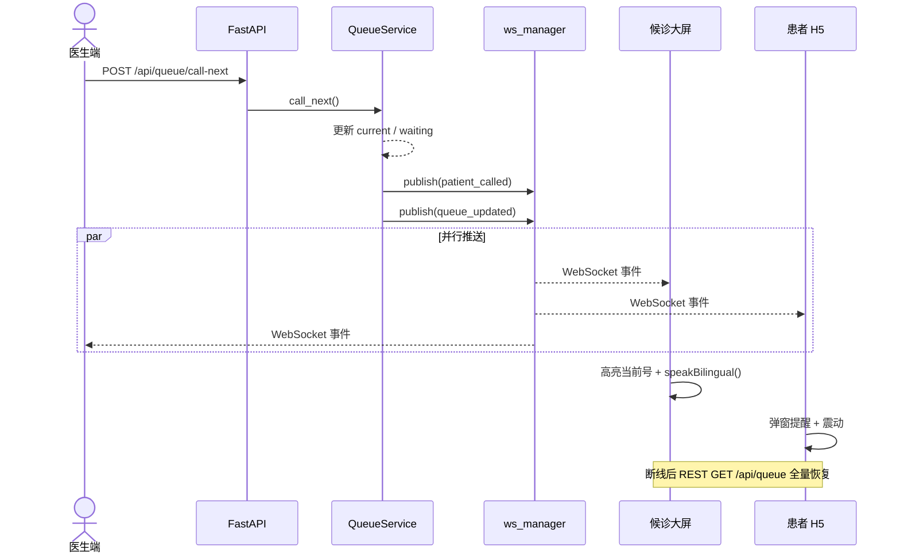
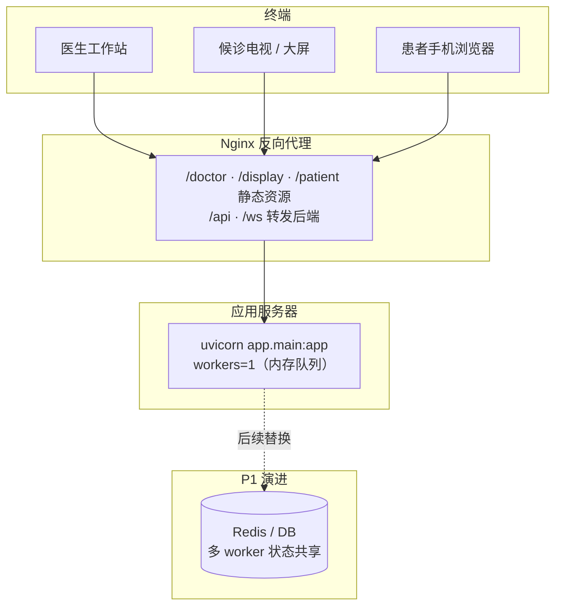

# 医院智能叫号系统 MVP

基于 5 条一线用户反馈设计的**多端实时叫号 + AI 分诊辅助**最小可行产品。技术栈：后端 Python (FastAPI + uv)，前端 Vue 3 (pnpm monorepo)。

---

## 环境要求

| 工具 | 版本建议 | 用途 |
|------|----------|------|
| Python | ≥ 3.11 | 后端运行时 |
| [uv](https://docs.astral.sh/uv/) | 最新 | 后端依赖安装与运行 |
| Node.js | ≥ 18 | 前端构建 |
| pnpm | ≥ 8 | 前端 monorepo |

```bash
# 检查是否已安装
python3 --version
uv --version
node -v && pnpm -v
```

---

## 启动与部署

### 1. 首次安装依赖

在项目根目录 `hospital/` 执行：

```bash
# 后端
cd backend
uv sync


# 前端
cd frontend
pnpm install
```

### 2. 环境变量（可选）

```bash
cp .env.example backend/.env
```

编辑 `backend/.env`，常用项：

```ini
# LLM（OpenAI 兼容；留空则自动走规则 Mock）
LLM_MODEL=openAI/gpt-3.5-turbo
LLM_API_BASE_URL=https://api.openai.com/v1
LLM_API_KEY=你的密钥
LLM_USE_MOCK=false

# 诊室信息
DEPARTMENT=心内科
ROOM=3号诊室
DOCTOR_NAME=赵主任

# 后端端口（默认 8000，避免与本机其他占 8000 的服务冲突）
PORT=8000
```

开发模式下前端通过 **Vite 代理** 访问 `/api`、`/ws`（无需配置 CORS）。若不用代理、直连后端：

```bash
export VITE_API_BASE=http://127.0.0.1:8000
export VITE_WS_URL=ws://127.0.0.1:8000/ws
```

### 3. 一键启动 / 停止（推荐本地演示）

```bash
chmod +x scripts/start.sh scripts/stop.sh

# 启动（后端 + 三端前端）
./scripts/start.sh

# 停止（另一终端执行，或关闭 start 终端后补跑）
./scripts/stop.sh
```

- **start.sh**：安装依赖 → 后端默认 **8000**（读 `backend/.env`）→ 前端 dev 自动代理到后端
- **stop.sh**：按端口（8000 / 5173–5175）结束本项目进程；`Ctrl+C` 亦可

> 若本机 **8000** 已被其他程序占用（如 `start_app.py`），请勿让前端直连 `localhost:8000`，应使用 `./scripts/start.sh` 或保持默认 8000。

### 4. 分终端启动（开发调试）

**终端 1 — 后端**

```bash
cd backend
uv run uvicorn app.main:app --host 0.0.0.0 --port 8000 --reload
```

**终端 2 — 前端三端**

```bash
cd frontend
pnpm run dev
```

或分别启动单个端：

```bash
pnpm run dev:doctor    # http://localhost:5173
pnpm run dev:display   # http://localhost:5174
pnpm run dev:patient   # http://localhost:5175
```

### 5. 访问地址

| 端 | 本地地址 | 说明 |
|---|---|---|
| 医生端 | http://localhost:5173 | 呼叫 / 跳过 / 暂停 |
| 候诊大屏 | http://localhost:5174 | 全屏 TV 模式，F11 全屏更佳 |
| 患者 H5 | http://localhost:5175 | 演示患者：李婷婷 A016 |
| API 文档 | http://127.0.0.1:8000/docs | Swagger（端口以 `.env` 为准） |
| 健康检查 | http://127.0.0.1:8000/api/health | 含 `llm_mock` 字段即为本项目后端 |

**演示路径**：打开三端 → 医生端「呼叫下一位」→ 大屏高亮 + 双语语音 → 患者端弹窗 + 震动。

### 6. 生产构建与部署

**后端**（单机 / 内网服务器）：

```bash
cd backend
uv sync
uv run uvicorn app.main:app --host 0.0.0.0 --port 8000 --workers 1
```

> MVP 使用内存队列，多 worker 会导致状态不一致，生产需改为 Redis/DB 后再加 workers。

**前端**（构建静态资源，由 Nginx 托管）：

```bash
cd frontend
pnpm install
pnpm run build
```

产物目录：

- `frontend/apps/doctor/dist`
- `frontend/apps/display/dist`
- `frontend/apps/patient/dist`

构建时需注入后端地址（示例）：

```bash
VITE_API_BASE=https://api.your-hospital.com \
VITE_WS_URL=wss://api.your-hospital.com/ws \
pnpm run build
```

**Nginx 反向代理示例**（三端 + API 同域）：

```nginx
# API + WebSocket
location /api/ { proxy_pass http://127.0.0.1:8000; }
location /ws {
  proxy_pass http://127.0.0.1:8000;
  proxy_http_version 1.1;
  proxy_set_header Upgrade $http_upgrade;
  proxy_set_header Connection "upgrade";
}

# 三端静态站（按路径或子域名拆分）
location /doctor/ { alias /var/www/hospital/doctor/; try_files $uri $uri/ /doctor/index.html; }
location /display/ { alias /var/www/hospital/display/; try_files $uri $uri/ /display/index.html; }
location /patient/ { alias /var/www/hospital/patient/; try_files $uri $uri/ /patient/index.html; }
```

### 7. 常见问题

| 现象 | 处理 |
|------|------|
| CORS / 404 访问 `/api/queue` | 多为 **8000 被其他程序占用**；执行 `./scripts/stop.sh` 后 `./scripts/start.sh`，或确认 `http://127.0.0.1:8000/api/health` 含 `llm_mock` |
| `address already in use` | `backend/.env` 改 `PORT`，并 `export BACKEND_PORT=同端口` 后重启前端 |
| 前端连不上后端 | 用 `start.sh` 启动（含 Vite 代理）；勿直连错误的 8000 服务 |
| 大屏无声音 | 使用 Chrome/Edge；需用户与页面有一次点击交互后浏览器才允许 TTS |
| LLM 始终 Mock | 检查 `backend/.env` 中 `LLM_API_KEY` 是否填写，且 `LLM_USE_MOCK=false` |

---

# 交付物 A：业务分析

## A1. 痛点提炼与用户画像

| 画像 | 来源反馈 | 核心痛点 | 归纳功能需求 |
|------|----------|----------|----------------|
| **老年患者·王大爷** | #1 | 大屏信息密度高、看不清；环境嘈杂听不到叫号；过号重排代价大 | 大屏**大字号高对比**、当前号**醒目高亮**；**语音重复播报**；患者端可见「前面几人」降低焦虑 |
| **外籍患者·David** | #2 | 界面与广播无英文，无法理解 | 大屏**中英双语展示**；叫号 **TTS 先中文后英文** |
| **孕产妇·李女士** | #3 | 急症无法在系统内调序，只能人工插队引发冲突 | **结构化紧急申请** + **AI 医学紧急度评估**；批准后队列自动前移并**全员可见「优先」标记** |
| **医生·赵主任** | #4 | 非队列人员敲门打断；患者不知进度 | **权威单一队列**由医生端驱动；患者端实时「前面 N 人」；叫号事件 **WebSocket 广播** |
| **护士长·张姐** | #5 | 手动插队引发纠纷；滥报紧急难甄别；断网系统瘫痪 | 优先规则**透明化**（标签+理由）；AI 辅助**识别非医疗理由**；**离线降级方案**（见 A3） |

**交叉洞察**：表面是「叫号不准」，本质是 **信息可达性**（看不清、听不懂）、**队列公信力**（插队不透明）、**系统韧性**（断网即停）。

---

## A2. 功能优先级矩阵

| 优先级 | 功能 | 理由 |
|--------|------|------|
| **P0** | 医生端呼叫/跳过/暂停 | 队列唯一控制源，解决 #4 诊室秩序 |
| **P0** | WebSocket 多端实时同步（<1s） | 考试硬性指标；减少患者反复询问 |
| **P0** | 候诊大屏：当前号高亮 + 等候前 5 | 直接回应 #1 看不清 |
| **P0** | 双语展示 + 双语 TTS 播报 | 回应 #2；大屏场景必备 |
| **P0** | 患者端：排队位置 + 预估等待 | 降低焦虑、减少敲门（#4） |
| **P0** | 患者被叫号强提醒（视觉+震动） | 回应 #1 听不见/没注意 |
| **P0** | AI 紧急度评估（结构化 JSON） | 回应 #3/#5：可审计的优先依据 |
| **P0** | 刷新后状态恢复（REST 全量 + WS 快照） | 状态一致性要求 |
| **P1** | 优先队列透明标签 + 护士复核台 | #5 减少走廊冲突，MVP 用「优先」徽章呈现 |
| **P1** | 过号自助重签/顺延规则 | #1 过号体验，需与 HIS 对接故延后 |
| **P1** | 多科室/多诊室路由 | 真实医院规模，MVP 单诊室简化 |
| **P1** | 离线降级完整实现（本地队列） | 见 A3，生产必备，MVP 以设计为主 |
| **P2** | 人脸识别/扫码取号 | 锦上添花 |
| **P2** | 就诊路径导航 AR | 非核心痛点 |
| **P2** | 满意度评价推送 | 与叫号稳定性无关 |

---

## A3. 离线降级方案

> MVP 以文字方案为主；代码层已实现「断线重连 + REST 全量恢复」，完整离线写盘可作为 P1 迭代。

### 1）断网检测机制

- **客户端**：WebSocket `onclose` / 心跳 `ping` 超时（本项目 25s）→ 切换「离线模式」UI；同时轮询 `GET /api/queue` 探测 API 是否恢复。
- **服务端**：各叫号屏/医生站上报心跳；边缘节点（分诊台 PC）若 **30s 无中心心跳** 且 ping 网关失败，判定**中心链路断开**。
- **网络层**：交换机 SNMP / 网关不通触发运维告警（对应 #5 交换机故障 40 分钟场景）。

### 2）降级运行策略

| 角色 | 降级行为 |
|------|----------|
| 医生端 | 切换**本地 SQLite 队列副本**（启动时同步快照）；继续「呼叫下一位」，事件写入本地 **op-log** |
| 大屏 | 读取**本机缓存**的最后状态；广播改用**局域网 UDP/蓝牙 TTS 缓存**重播；显示「离线模式」横幅 |
| 患者端 | 展示本地缓存的「前面 N 人」并标注「可能不是最新」；**禁止**离线自动批准优先，仅「提交待同步」 |
| 分诊台 | 护士长用**纸质加急单**编号，与系统「待复核」队列对应，恢复后统一录入 |

**原则**：离线期 **宁可慢叫不可乱叫**——不自动执行 AI 批准的插队，仅记录申请。

### 3）恢复后数据同步策略

1. **版本向量**：每条 op-log 含 `{device_id, monotonic_seq, timestamp, payload}`。
2. **重连握手**：设备上报 `last_seq`，中心返回增量或全量快照。
3. **冲突合并**：以**医生端本地操作**为叫号真相源；患者端仅消费；重复叫号以 `ticket_number + called_at` 去重。
4. **护士操作**：离线期间的优先申请进入 `manual_review` 队列，由张姐一次性确认。
5. **审计**：同步完成后生成《断网期间事件报告》供医务处备案。

---

## A4. AI 工具使用说明与人工分工

本项目涉及 **两类 AI**：一是**开发阶段**用 AI 辅助写代码与文档；二是**运行阶段**用 LLM 做患者「紧急优先」评估（交付物 C1）。二者用途不同，不宜混为一谈。

### 使用的 AI 工具（简述）

| 工具 / 能力 | 用途 | 是否接入产品运行时 |
|-------------|------|-------------------|
| **Cursor（Agent / 对话）** | 需求整理、代码与 UI 实现、联调排错、README 撰写 | 否（仅开发环境） |
| **大模型 API**（OpenAI 兼容，默认 MiMo `mimo-v2.5`） | 患者提交理由后的紧急度 JSON 评估 | **是**（`backend/app/llm_service.py`） |
| **规则 Mock**（关键词，非生成式） | 无 API Key、考场离线、LLM 失败时兜底 | **是**（与 LLM 同接口返回） |
| **浏览器 Web Speech API** | 大屏双语叫号播报 | **是**（非大模型，本地 TTS） |

未使用 AI 生成图片、视频或预录语音；候诊大屏动效与三端界面均为代码实现（CSS / Vue）。

### 各环节：如何使用、如何分工

| 环节 | AI 做了什么 | 人工做了什么（终审 / 裁量） |
|------|-------------|---------------------------|
| **A1–A3 业务分析** | 根据 5 条反馈草拟痛点表、优先级矩阵、离线方案条目 | 确认 MVP 只做单诊室；P0 边界；「离线不自动批准插队」等安全原则 |
| **架构与接口** | 建议 FastAPI + 内存队列 + WebSocket 事件名 | 采纳「单进程内存队列 + REST 全量 + WS 广播」；否决多 worker（MVP 不一致） |
| **C1 Prompt 与评估逻辑** | 起草 `SYSTEM_PROMPT`、JSON 字段说明、反 VIP/赶时间条文 | 补充中文场景（孕晚期腹痛、胸闷出血）；**仅当 `approve` 且 `is_medical_emergency` 才插队**；失败回退 Mock |
| **C1 规则 Mock** | 生成关键词列表初稿 | 核对通过/拒绝/人工复核三类与答辩演示路径一致 |
| **后端实现** | 生成 `queue_service`、`llm_service`、API 路由初稿 | 联调 WS、10 人 Mock 数据、优先排序、`llm_mock` 健康检查 |
| **候诊大屏 UI** | 深色科技风布局、叫号蒙层、三语播报调用方式 | 一屏 10 人双列、防 `overflow` 裁切；语音默认开启、连播 3 遍；字号与对比度实测 |
| **医生控制台 UI** | 炫酷/简洁多套布局草稿 | 定稿白底一屏、上下结构；**工作提示**（按序、可暂停、不必赶） |
| **患者 H5 UI** | 票号卡片、优先申请弹层、结果区布局 | 修正结果区 flex 错位；**候诊安抚文案**、进度条、轮换小贴士 |
| **双语 TTS** | 说明 Web Speech API 用法 | 固定「中文 → 0.5s → 英文」；接受浏览器需一次点击才能出声 |
| **联调与演示脚本** | `start.sh`、Vite 代理思路 | 端口占用检测、`/api/health` 含 `llm_mock` 才算本后端 |
| **README / 自检清单** | 结构化章节与表格草稿 | 与真实代码路径对齐；勾选可验证项 |

### 运行阶段 LLM（C1）如何使用

1. 患者在 H5 提交 `reason`（一句话症状/理由）。  
2. 后端 `POST /api/priority/request` 调用 `assess_urgency(reason)`。  
3. 若已配置 `LLM_API_KEY` 且未强制 Mock：请求 OpenAI 兼容 `chat/completions`，`temperature=0.1`，`response_format=json_object`。  
4. 解析为 `UrgencyAssessment`；异常或缺 Key 时走 **`_mock_assess` 关键词规则**（与 Prompt 意图一致，保证可演示）。  
5. **人工规则兜底**：即使模型返回 `approve`，仍要求 `is_medical_emergency=true` 才标记优先；`manual_review` 不自动插队。

配置见 `backend/.env`（示例见 `.env.example`）。是否真调模型以 `GET /api/health` 的 `llm_mock` 为准。

### 分工原则（一句话）

- **AI**：扩面、草稿、重复性代码、Prompt 初稿、多版 UI 探索。  
- **人工**：医疗与产品红线、能否上线演示、最终交互与文案、联调通过、安全边界（离线、Mock、不自动插队）。

**人工终审红线（本 MVP 明确遵守）**

1. 离线或 LLM 不可用 → 不自动批准优先，仅 Mock/记录。  
2. LLM 失败 → 回退规则 Mock，不阻塞叫号主流程。  
3. 非医疗理由（VIP、赶时间等）→ 必须可拒绝（Prompt + Mock 双重保障）。  
4. 叫号顺序仍以医生端为准；AI 只影响「是否标优先」，不替代医生呼叫。

---

# 交付物 B & C：实现说明

## 项目架构设计

### 系统总览



### 后端模块分层



### 叫号实时同步时序



### 部署拓扑（生产参考）



**设计要点**

| 层级 | 职责 | 关键文件 |
|------|------|----------|
| 表现层 | 三端 UI + 共享 SDK | `frontend/apps/*`、`packages/shared` |
| 接入层 | REST 全量 + WS 增量 | `backend/app/main.py`、`ws_manager.py` |
| 领域层 | 队列调度、优先规则 | `backend/app/queue_service.py` |
| AI 层 | 紧急度 JSON 评估 | `backend/app/llm_service.py` |
| 数据层 | MVP 内存态（单进程） | `queue_service` 内部状态；生产需 Redis/DB |

## API 摘要

- `GET /api/queue` — 全量队列状态
- `POST /api/queue/call-next` — 呼叫下一位
- `POST /api/queue/skip` — 跳过当前
- `POST /api/queue/pause` / `resume` — 暂停/恢复
- `POST /api/priority/request` — AI 紧急度评估 + 队列调整
- `WS /ws` — 实时事件：`patient_called`, `queue_updated`, `calling_paused`, `priority_applied`

## C1. LLM 紧急度评估

- 配置项：`LLM_MODEL`, `LLM_API_BASE_URL`, `LLM_API_KEY`（见 `.env.example`）
- 无 Key 或 `LLM_USE_MOCK=true` 时使用 **规则 Mock**（关键词：胸闷、出血、孕腹痛 → approve；VIP、赶时间 → reject）
- Prompt 要求 **仅输出 JSON**，含 `recommendation: approve|reject|manual_review`

## C2. 双语语音叫号（TTS）

- 方案：**浏览器 Web Speech API**（免费、无需 API Key，适合考场本地演示）
- 模板：中文「请 {号} 号 {姓名}，到 {诊室} 就诊」→ 间隔 0.5s → 英文 `"Number {号}, {英文名}, please proceed to {诊室}"`
- 触发：大屏端收到 `patient_called` 事件后调用 `speakBilingual()`（见 `frontend/packages/shared`）

> 生产环境可替换为 Azure TTS / 讯飞等；接口封装在 shared 包，便于 swapping。

---

## 项目结构

```
hospital/
├── backend/          # Python + uv + FastAPI
├── frontend/
│   ├── apps/doctor|display|patient
│   └── packages/shared
├── scripts/start.sh
└── README.md
```

## 自检清单

- [x] README 含 A1–A4 业务分析
- [x] 三前端 + 后端可运行
- [x] 医生呼叫 → 大屏/患者 1s 内同步
- [x] WS 断线自动重连
- [x] 刷新页面后 REST 恢复状态
- [x] 插队申请触发 LLM/Mock 结构化结果
- [x] 叫号触发双语 TTS


